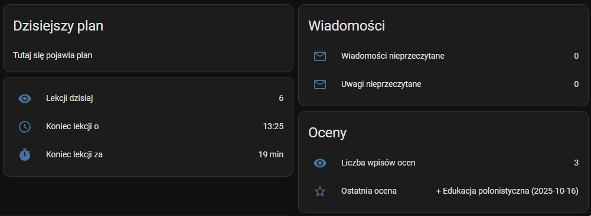

# Librus Proxy API

Minimalne Node.js API do odczytu danych z Librus Synergia (oceny, plan lekcji, wiadomości, prace domowe).

Użyta biblioteka (zewnętrzny tool): [librus-api by Mati365](https://github.com/Mati365/librus-api)

API może działać jako samodzielny serwer (Docker) oraz integrować się z Home Assistant (REST + template sensors).

## Funkcje

- logowanie do Librus Synergia (login/hasło),
- pobieranie ocen,
- plan lekcji: `/timetable` i `/timetable/today`,
- wiadomości (odebrane/uwagi),
- zadania domowe (jeśli dostępne),
- Swagger UI pod `/docs` (OpenAPI).

## Wymagania

- Docker / Docker Compose (zalecane),
- konto w Librus Synergia.

## 1. Konfiguracja środowiska

Skopiuj plik `.env.example` i uzupełnij danymi logowania:

```bash
cp .env.example .env
```

Przykładowe zmienne:

```bash
LIBRUS_LOGIN=twoj_login
LIBRUS_PASSWORD=twoje_haslo
STUDENT_INDEX=0
PORT=3000
API_KEY=opcjonalny_klucz_api
```

## 2a. Uruchomienie w Dockerze

```bash
docker compose up -d --build
```

## 2b. Uruchomienie z gotowych obrazów Dockera

Gotowy obraz dostępny publicznie w Docker Hub:

```bash
docker pull normanp2pl/librus-proxy:latest
```

lub, alternatywnie, w GitHub Container Registry (GHCR):

```bash
docker pull ghcr.io/normanp2pl/librus-proxy:latest
```

Można go uruchomić lokalnie np. tak:

```bash

docker run --rm -p 3300:3000 \
  -e LIBRUS_LOGIN=twoj_login \
  -e LIBRUS_PASSWORD=twoje_haslo \
  -e STUDENT_INDEX=0 \
  normanp2pl/librus-proxy:latest
```

## 3. Po uruchomieniu:

- Swagger UI: http://localhost:3000/docs
- Healthcheck: http://localhost:3000/healthz

- /grades	Oceny i przedmioty
- /timetable	Plan lekcji (tydzień)
- /timetable/today	Plan tylko na dziś
- /messages	Wiadomości (np. folderId=5)
- /homeworks	Zadania domowe
- /announcements	Ogłoszenia
- /docs	Swagger UI

## 4. OpenAPI / Swagger

Specyfikacja znajduje się w openapi.yaml.

Uniwersalna konfiguracja servers (autowykrywanie hosta/portu):

```yaml
servers:
  - url: /
    description: Current host (auto-detect)
```

Możesz też dodać dodatkowe wpisy:

```yaml
servers:
  - url: /
    description: Current host (auto-detect)
  - url: http://localhost:3000
    description: Local dev
  - url: https://example.com/api
    description: Production
```

## 5. Integracja z Home Assistant

configuration.yaml
```yaml
rest:
  # ===== GRADES =====
  - resource: "http://localhost:3000/grades"
    method: GET
    scan_interval: 900  # co 15 min
    sensor:
      - name: "Librus Grades Count"
        unique_id: librus_grades_count
        value_template: "{{ value_json.count | int(0) }}"
        json_attributes:
          - data   # cała lista ocen jako atrybut (przyda się do dalszych templatek)

  # ===== TIMETABLE (cały tydzień od poniedziałku) =====
  # REST wspiera resource_template, więc wyliczamy weekStart dynamicznie
  - resource_template: >
      http://localhost:3000/timetable?weekStart={{ (now().date() - timedelta(days=now().weekday())).isoformat() }}
    method: GET
    scan_interval: 1800  # co 30 min
    sensor:
      - name: "Librus Timetable"
        unique_id: librus_timetable
        value_template: "{{ value_json.lessons | int(0) }}"
        json_attributes:
          - data   # lista dni z lekcjami

  # ===== MESSAGES (Odebrane = folderId 5, Uwagi = folderId 10) =====
  - resource: "http://localhost:3000/messages?folderId=5"
    method: GET
    scan_interval: 300  # co 5 min
    sensor:
      - name: "Librus Inbox Total"
        unique_id: librus_inbox_total
        value_template: "{{ value_json.total | int(0) }}"
        json_attributes:
          - data   # lista wiadomości (id, subject, read, etc.)
  - resource: "http://localhost:3000/messages?folderId=10"
    method: GET
    scan_interval: 300  # co 5 min
    sensor:
      - name: "Librus Inbox Total Uwagi"
        unique_id: librus_inbox_total_uwagi
        value_template: "{{ value_json.total | int(0) }}"
        json_attributes:
          - data   # lista wiadomości (id, subject, read, etc.)
  - resource: "http://localhost:3000/timetable/today"
    method: GET
    scan_interval: 900  # co 15 min (zmień wg potrzeb)
    sensor:
      - name: "Librus Timetable Today"
        unique_id: librus_timetable_today
        value_template: "{{ (value_json.lessons | length) if value_json.ok else 0 }}"
        json_attributes:
          - date
          - lessons
template:
  - sensor:
      # Dzisiejsza liczba lekcji:
      - name: "Librus Today Lessons Count"
        state: >
          
          
          
          {{ (day.lessons | length) if day else 0 }}

      # Dzisiejszy plan jako tekst (ładny podgląd w karcie Markdown / Entities):
      - name: "Librus Today Lessons Text"
        unique_id: librus_today_lessons_text
        icon: mdi:calendar-clock
        state: >
          
          
          
          {{ day.lessons | count if day else 0 }}
        attributes:
          text: >
            
            
            
            
              
                {{ l.start }}–{{ l.end }} {{ l.subject }} ({{ l.teacher }}){{ '\n' if not loop.last }}
              
            brak

      # Liczba nieprzeczytanych (na podstawie atrybutu `data` z /messages)
      - name: "Librus Unread Messages"
        icon: mdi:email-outline
        state: >
          
          
          {{ unread | length }}
      - name: "Librus Unread Messages Uwagi"
        icon: mdi:email-outline
        state: >
          
          
          {{ unread | length }}

      # Ostatnia (najświeższa) ocena – skrót
      - name: "Librus Latest Grade"
        unique_id: librus_latest_grade
        icon: mdi:star-outline
        state: >
          
          
          
          
          
            
            {{ (latest.value | default('')) ~ ' ' ~ (latest.subject | default('')) ~ ' (' ~ (latest.date | default('')) ~ ')' }}
          
            brak
          
        attributes:
          subject: >
            
            
            
            
            
            {{ latest.subject if latest else '' }}
          value: >
            
            
            
            
            
            {{ latest.value if latest else '' }}
          date: >
            
            
            
            
            
            {{ latest.date if latest else '' }}

      - name: "Librus Child Finish Today"
        unique_id: librus_child_finish_today_ts
        device_class: timestamp
        state: >
          
          
          
          
            
            
              {# zamień 'HH:MM' -> datetime i wybierz najpóźniejszy #}
              
              
              {{ (latest | as_timestamp) | timestamp_custom('%Y-%m-%dT%H:%M:%S%z', true) }}
            unknown
          unknown

      - name: "Librus Child Finish Today (HH:MM)"
        unique_id: librus_child_finish_today_hhmm
        icon: mdi:clock-outline
        state: >
          
          
            {{ (ts | as_datetime | as_local).strftime('%H:%M') }}
          brak

      - name: "Librus Minutes Until Finish"
        unique_id: librus_minutes_until_finish
        icon: mdi:timer
        unit_of_measurement: min
        state: >
          
          
            
            
            {{ [mins, 0] | max }}
          0
```

Lovelace (GUI) - przykładowy wpis do GUI HA

```yaml
- type: masonry
    path: ''
    icon: mdi:account-school
    cards:
      - type: markdown
        title: Dzisiejszy plan
        content: |
          {{ state_attr('sensor.librus_today_lessons_text','text') }}
      - type: entities
        entities:
          - entity: sensor.librus_timetable_today
            name: Lekcji dzisiaj
          - entity: sensor.librus_child_finish_today_hh_mm
            name: Koniec lekcji o
          - entity: sensor.librus_minutes_until_finish
            name: Koniec lekcji za
      - type: entities
        title: Wiadomości
        entities:
          - entity: sensor.librus_unread_messages
            name: Wiadomości nieprzeczytane
          - entity: sensor.librus_unread_messages_uwagi
            name: Uwagi nieprzeczytane
      - type: entities
        title: Oceny
        entities:
          - entity: sensor.librus_grades_count
            name: Liczba wpisów ocen
          - entity: sensor.librus_latest_grade
            name: Ostatnia ocena
```
## 6. Continuous Integration (GitHub Actions)

Repozytorium zawiera gotowy workflow GitHub Actions (`.github/workflows/docker.yml`),  
który automatycznie:

- buduje obraz Dockera dla architektur `amd64` i `arm64`,
- publikuje go do **GitHub Container Registry (GHCR)** oraz **Docker Hub**,
- taguje obraz jako:
  - `latest` (dla gałęzi `main`),
  - `vX.Y.Z` (dla tagów wersji),
  - oraz `sha-<commit>` (dla każdego commitu).

Workflow uruchamia się automatycznie po każdym:
- `git push` do gałęzi `main`,
- utworzeniu taga `v*.*.*`,
- lub ręcznie z poziomu GitHub Actions (`Run workflow` → `docker`).

## 7. Bezpieczeństwo

Jeśli ustawisz zmienną API_KEY, API będzie wymagało nagłówka X-API-Key w żądaniach.
W Home Assistant dodaj odpowiedni nagłówek w integracji REST.

## 8. Licencja / zastrzeżenia

Projekt ma charakter edukacyjny i nie jest powiązany z Librus Sp. z o.o.
Dane logowania używane są wyłącznie do autoryzacji sesji; nie są przechowywane w bazie.